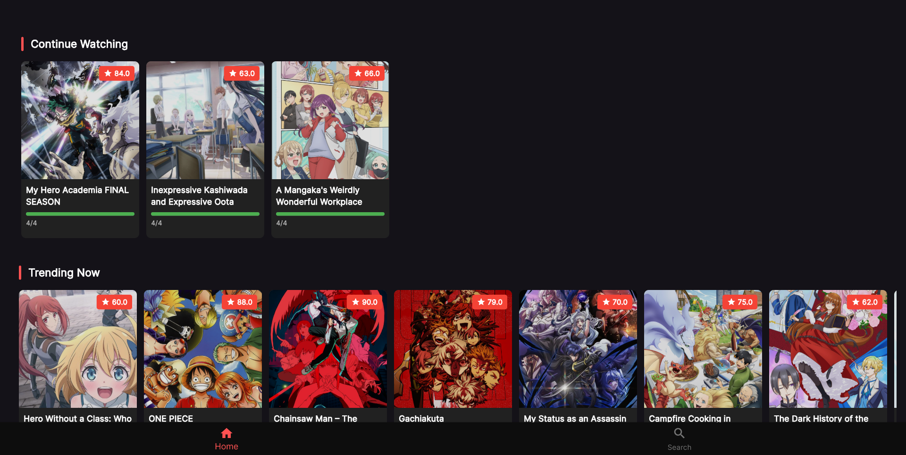
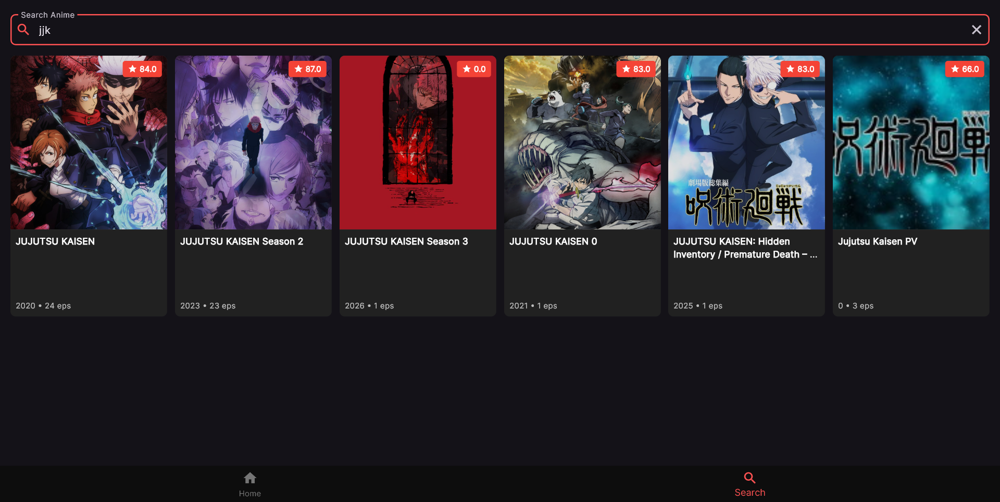
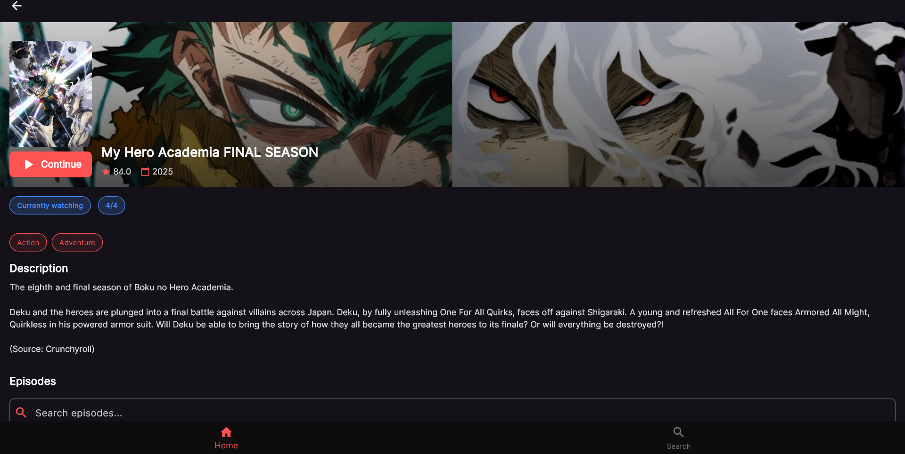
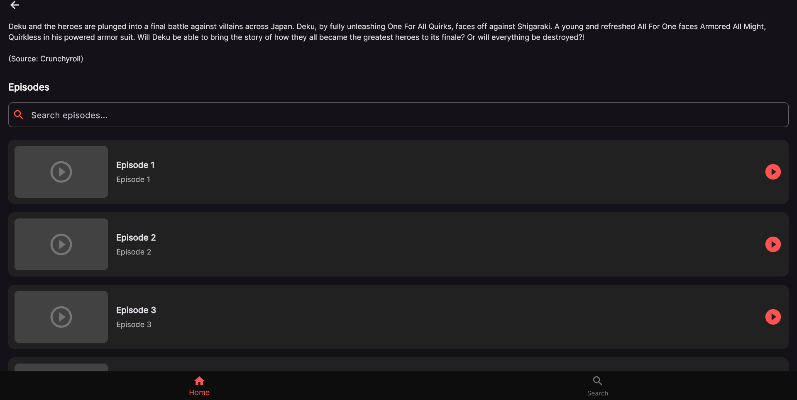

# MiraiTV

A modern crossplatform anime streaming app built with Flutter.

##  Acknowledgements

* **[ani-cli](https://github.com/pystardust/ani-cli)**: For the heavy inspiration and foundational concept of a simple, effective anime streaming tool.

## Screenshots
- Home

- Search

- Anime

- Anime Episodes

##  Features

*  **True Cross-Platform Support:** Built with Flutter to provide a seamless and native experience on **Android, iOS, Windows, macOS, and Linux** from a single codebase.

*  **Seamless AniList Integration:** Connect your AniList account to automatically sync your watch progress, lists, and ratings in real-time.

* **Powerful Search & Discovery:** Find new shows, browse currently trending anime, and search the entire AniList catalog with ease.
## Roadmap

- Adding filtering and forting to search
- Video player screen improvements
- Video resuming from last played timestamp
- Auto skipping intro and outro
- Save to watchlist feature

##  Contributing

Contributions are always welcome! We value community input and pull requests.

Please read our contribution guidelines before getting started:

* See **[CONTRIBUTING.md](CONTRIBUTING.md)** for detailed instructions on how to set up your environment and ways to get started.

### Ways to Contribute

* Look through the [**open issues**](https://github.com/Saadiq8149/MiraiTV/issues) to find something to work on.
* Found a bug? [**Open a new issue**](https://github.com/Saadiq8149/MiraiTV/issues/new/choose) and use the bug report template.
* Have a feature idea? [**Open a feature request**](https://github.com/Saadiq8149/MiraiTV/issues/new/choose) to discuss it.
## License

[MIT](https://choosealicense.com/licenses/mit/)

## Authors

- [@octokatherine](https://www.github.com/Saadiq8149)

